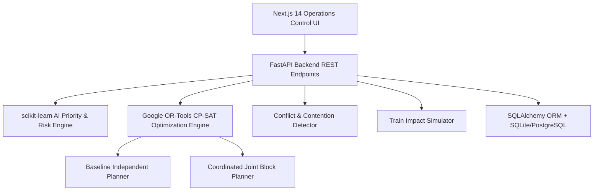

# RAILOPT AI — AI-Powered Automatic Block Planning to Maximize Asset Availability for Train Operations on Indian Railways

**Smart India Hackathon 2026 Solution**  
**Problem Statement ID**: SIH26027  
**Ministry**: Ministry of Railways (Government of India)  
**Domain**: Transportation & Logistics  
**Tagline**: *"AI-Powered Railway Maintenance & Block Optimization"*  

---

## Executive Overview

**RAILOPT AI** is an enterprise-grade Decision Support System (DSS) engineered for Indian Railways Operations Control Rooms. It solves the operational inefficiency of independent departmental maintenance block requests (Engineering, Traction Distribution / OHE, Signal & Telecommunication). 

By ingesting synthetic operational data from TMS (Track Management System), SMMS (Signalling Maintenance & Management System), TDMS (Traction Distribution Management System), BDMS (Block Demand Management System), and COA (Control Office Application), **RAILOPT AI** employs **Google OR-Tools CP-SAT Constraint Programming** to coordinate joint maintenance windows, maximize asset availability, and minimize train delays.

---

## Core Problem Statement (SIH26027)

Currently, railway departments submit maintenance block requests independently:
1. **Engineering (P-Way)**: Track tamping, rail replacement, bridge maintenance.
2. **Traction Distribution (TRD)**: Overhead Line (OHE) inspection, transformer filtration.
3. **Signal & Telecommunication (S&T)**: Point Machine overhaul, track circuit calibration.

Without multi-departmental coordination, sections are blocked repeatedly throughout the week, causing:
- Excessive corridor downtime.
- Train traffic bottlenecks & passenger delays.
- Crew and track resource conflicts.

---

## Technical Stack

- **Frontend**: Next.js 14 (App Router), TypeScript, Tailwind CSS, Lucide Icons, Recharts, Framer Motion, Leaflet GIS.
- **Backend**: Python 3.11, FastAPI, Pydantic v2, SQLAlchemy, SQLite (`railopt_demo.db`).
- **Optimization Engine**: Google OR-Tools CP-SAT Solver (`ortools.sat.python.cp_model`).
- **AI/ML Engine**: scikit-learn explainable priority scoring & failure risk probability estimator.
- **Data Generator**: `/backend/data/generate_demo_data.py` (520+ tasks, 120+ assets, 50+ sections, 1050+ movements under fixed seed 42).

---

## System Architecture



---

## Installation & Setup Guide

### 1. Prerequisites
- Node.js v18+ and npm v9+
- Python 3.10+

### 2. Backend Setup
```bash
cd backend
python -m pip install -r requirements.txt
python seed_demo.py
python -m uvicorn main:app --host 127.0.0.1 --port 8000
```

### 3. Frontend Setup
```bash
cd frontend
npm install
npm run dev
```
Open [http://localhost:3000](http://localhost:3000) in your browser.

---

## SIH 2026 Hackathon Demo Flow (5-Minute Walkthrough)

1. **Login Page**: Click **CONTROL001** (Control Officer) quick credentials (`demo123`).
2. **Executive Dashboard**: Inspect high-impact KPI cards:
   - Asset Availability: `94.7% (+8.3%)`
   - Downtime Saved: `114.5 hrs`
   - Conflicts Avoided: `37`
3. **Live Operations Control Room**: View interactive GIS corridor canvas, section list, active blocks, and event log.
4. **Automatic Block Planner**: Select 7-day horizon & "Maximum Asset Availability" objective -> Click **GENERATE OPTIMIZED BLOCK PLAN**.
5. **Optimization Progress Animation**: Observe real-time solver steps evaluating CP-SAT constraints.
6. **Before vs After Optimization Impact**: Review direct side-by-side metric comparison (Block Hours 184h &rarr; 121h, Downtime 241h &rarr; 126h, Conflicts 29 &rarr; 3).
7. **Gantt Timeline**: Inspect departmental swimlanes and click Block Details Drawer.
8. **RailOpt Copilot**: Ask "How much downtime did optimization save?" for instant decision support.

---

## Demo Credentials

- **Employee ID**: `CONTROL001`
- **Password**: `demo123`
- **Department**: Operations Control Office
- **Role**: Control Officer

---

## Disclaimer

> **Demo Environment — Synthetic Operational Data**: This system uses synthetic operational data calibrated to Indian Railways corridor metrics ("Demo Railway Division"). Internal railway systems (TMS, SMMS, TDMS, BDMS, COA) are represented by clean adapter interfaces ready for future live API integration.
